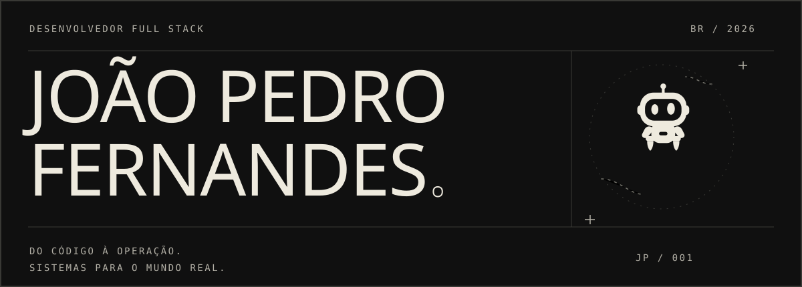
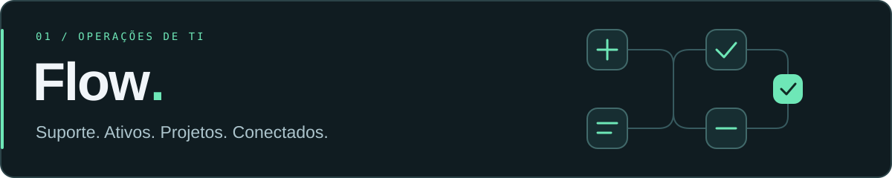
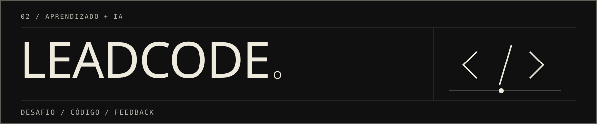
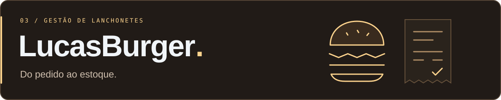

  <a href="README.md">Português</a> · English

  

  <strong>Software developer · Founder of Appruma</strong> 
  I build applications that organize operations, connect services and simplify everyday work.

  <a href="https://joaopedrofernandes.com.br"><strong>My portfolio ↗</strong></a>
  &nbsp; / &nbsp;
  <a href="#featured-projects">Explore my projects ↓</a>
  &nbsp; / &nbsp;
  <a href="#what-i-build">What I build ↓</a>

  joaopedrofernandes.com.br · portfolio under construction

## A little about me

I'm João Pedro. I enjoy understanding how an operation works and translating its needs into software: from data models and business rules to integrations and the interface people use every day.

My foundation is **PHP and Laravel**, with **React and Vue** on the frontend. My projects explore management systems, platform integrations and AI-powered applications. I'm also the founder of **Appruma**, where I'm building a product for independent professionals.

## Featured projects

### 01 / Flow

A platform combining **help desk, IT asset management and projects**, with dedicated portals for administrators, agents and clients.

- **The problem:** support requests, equipment and projects scattered across different tools.
- **In the project:** priority and SLA rules, Kanban boards, Active Directory and GitHub integrations.
- **What it demonstrates:** process modeling, enterprise integrations and interfaces for different user roles.

`Laravel` `Vue` `TypeScript` `Inertia.js` `MySQL` `Tailwind CSS`

[Explore Flow →](https://github.com/sistemout123/Flow)

### 02 / LeadCode

A **technical interview practice platform** with coding challenges, an in-browser editor and AI feedback.

- **The problem:** practicing algorithms without guidance on how to improve a solution.
- **In the project:** Monaco Editor, contextual hints, submission history and progress through XP and levels.
- **What it demonstrates:** AI API integrations, provider abstraction and an interactive learning experience.

`Laravel` `React` `TypeScript` `SQLite` `Monaco Editor` `Gemini · Claude · OpenAI`

[Explore LeadCode →](https://github.com/sistemout123/LeadCode)

### 03 / LucasBurger

A **restaurant management project** connecting orders, tables, payments and ingredient inventory.

- **The problem:** keeping service and stock movements organized within the same operation.
- **In the project:** order and payment APIs, an administration panel, stock and inventory services.
- **What it demonstrates:** business rules, relational data modeling and database transactions.

`PHP` `Laravel` `Filament` `REST API` `Tailwind CSS`

[Explore LucasBurger →](https://github.com/sistemout123/LucasBurger)

## What I build

| Area | In practice |
| :--- | :--- |
| **Backend and business logic** | PHP/Laravel applications, REST APIs and services for operational workflows. |
| **Web interfaces** | Pages and components using React, Vue, JavaScript, TypeScript, HTML and CSS. |
| **Data** | Relational modeling, migrations, Eloquent and SQL with MySQL and SQLite. |
| **Integrations** | GitHub, OAuth, webhooks and Active Directory/LDAP, as used in Flow. |
| **Applied AI** | Coding feedback and hints using different AI providers in LeadCode. |
| **Management systems** | Dashboards, record management and operational workflows; experience with Adianti as well. |

## Building Appruma

**Technology for people who run their own business.**

I'm the founder of Appruma, a product in development for independent beauty, tattoo and service professionals. The goal is to bring **appointments, clients and day-to-day work** together in one place.

It is where I connect software development with building a product around a clear problem.

## Every contribution counts

<picture>
  <source media="(prefers-color-scheme: dark)" srcset="https://raw.githubusercontent.com/sistemout123/sistemout123/output/github-snake-dark.svg" />
  <source media="(prefers-color-scheme: light)" srcset="https://raw.githubusercontent.com/sistemout123/sistemout123/output/github-snake.svg" />
  
</picture>

  One project, one improvement, one contribution at a time.

---

  <strong>Discover more of my work</strong>  
  <a href="https://joaopedrofernandes.com.br">joaopedrofernandes.com.br ↗</a> 
  My portfolio is under construction. In the meantime, explore the projects above.

